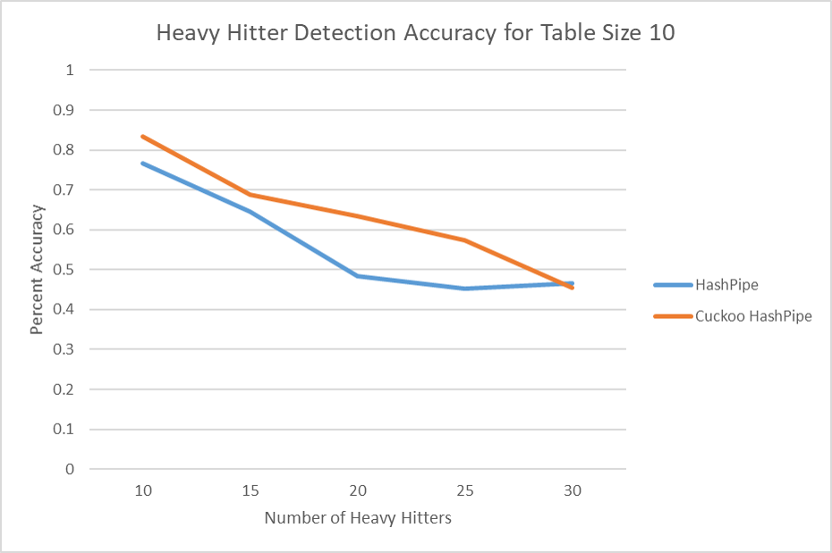
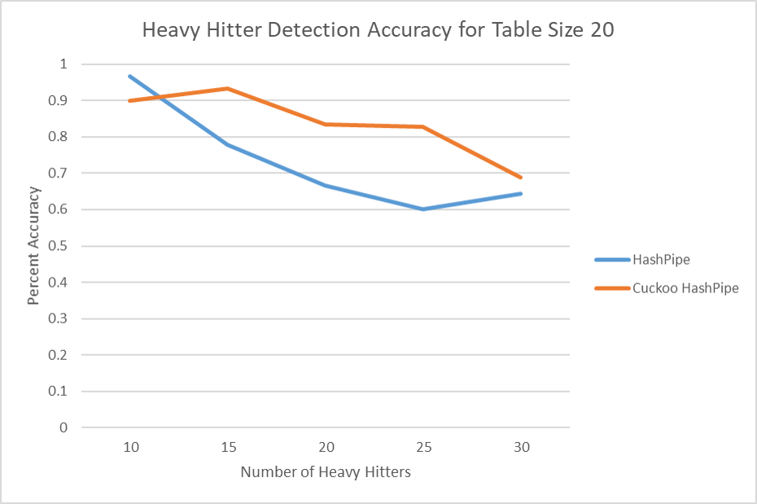
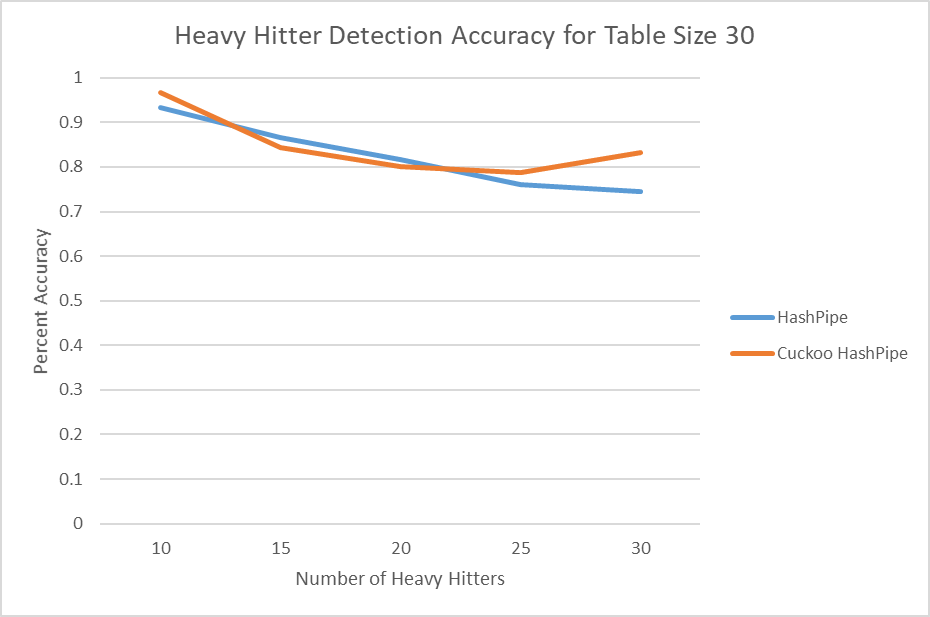
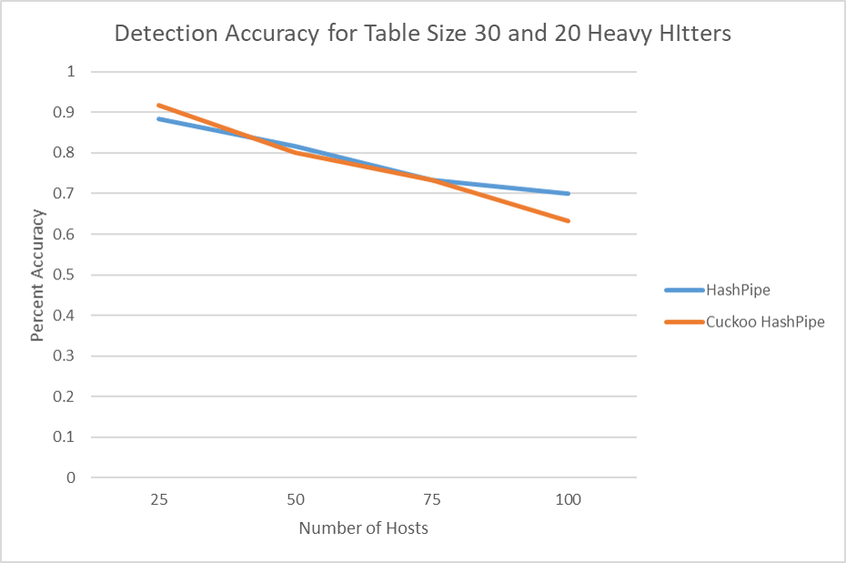

We have re-implemented and measured [HashPipe][1]. This algorithm approximately
calculates the top heavy-hitters on a switch. To do this, it defines a pipeline of
`n` hash tables that record the byte-counts for each incoming flow. Of course, these
tables are finite, so it cannot actually record every flow, and so we must specify
a collision and eviction scheme.

Additionally, we introduce, implement, and evaluate a novel variation to the structure
original HashPipe paper.  Our modification consists of using unique hash functions
within a single table for each subsequent pipeline stage, which allows for improved
key distribution and so helps minimize the probability of evicting a heavy-hitter.

### Actions (Control Flow)

We define two different kinds of actions, `flow_in` and `heavy_hitter`: the `flow_in`
action handles flows as they come in and acts as a MRU cache; the `heavy_hitter`
actions add heavy-hitters to later stages in the pipeline calculations. There is
only one call to the `flow_in` action, but there may be arbitrarily many calls to
`heavy_hitter` actions.

The `flow_in` action always accepts the incoming packet. It, as its name implies,
computes the hash function for the key of the incoming flow and stores it in the
associated table index.  An important observation about this action is the requirement
that local action variables, such as `currIndex` and `currDiff`, are stored in the
metadata header to allow for concurrent computations. If there is a collision `flow-in`
writes-back the previous value at the given table index to the first `heavy_hitter`
action.  Collisions are identified to occur in both the `flow-in` and `heavy-hitter`
actions when the `validBit` of a given index is 1.  Write-back values are stored
in the metadata fields `fwdKey` and `fwdCount`.

In the `heavy-hitter` action, we accept writes only when `fwdKey` and `fwdCount`
are non-zero.  When a packet collides with another in a `heavy-hitter` hash table,
the flow that has the greater byte-count is left in place, and the flow that has
the lesser is written back to the next `heavy-hitter` action in the pipeline. If
the flows are the same, however, then the incoming count and current count are summed.
If the current `heavy-hitter` action is the last one, we drop the packet count from
the table. Hash tables are not implemented as switch-level `tables` but as _register
arrays_.  

### Implementation Notes

Our initial HashPipe implementation pipeline mimics the example given in the paper
and uses three stages, each of equal size.  Note that only one register array is
necessary for actual implementation, as each abstract table can be represented in
an offset block within the register.

When applying a unique hash function to each stage of the pipeline, we make the following
adjustments.  First, the table structure of the pipeline is modified so that the
`flow_in` action uses a single table, but each `heavy-hitter` action uses the same
table for checking for collisions.  Second, `flow_in` uses the same hash function
as the first call to the `heavy-hitter` action, since the `flow_in` cache does not
directly interact with the cache used by each `heavy-hitter` action.  Third, each
call to `heavy-hitter` uses a unique hash function to properly distribute key values.

### Evaluation

As a simple test of correctness, we instantiated the hash tables with size two, and
create a simple topology of five hosts `h1,h2,h3,h4` connected via one switch.  We
then found that pings between h1<-->h2, h3<-->h4, and h2<-->h3 in sequence succesfully result
in the correct ping counts with h1 and h2 in the second table and h3 and h4 in the first
table.

Once a baseline notion of correctness was established, we proceeded to test the efficiency of the original HashPipe solution and compare the results to our implementation.  A series of tests were run using 50 hosts connected in a star network configuration to a single switch which counted incoming flows and allowed routing between each host.  This switch was programmed with our action implementation described above such that there were 3 tables, table sizes of 10, 20, and 30, and a variable number of heavy-hitters.  In particular, this configuration was tested with each table size for 10, 15, 20, 25, and 30 heavy-hitter counts.  

Tests were setup by having each host ping a member of the heavy-hitter set 10 times.  The heavy-hitter set consisted of the ip addresses [10.0.0.10, 10.0.1.10, ..., 10.0.n.10], where `n` is the number of heavy hitters.  In this manner, each heavy-hitter would send traffic inversely proportional, on average, to the size of the heavy-hitter set; however, with this configuration, each heavy-hitter will on average send at least twice as much traffic as a non-heavy-hitter.  The results of running these tests can be seen in the following charts.

  

We observe that Cuckoo HashPipe tends to perform better than the original implementation of HashPipe; however, the discrepency between the two tends to vanish as the tables become large.  With these results, we wanted to examine if these results continued as the number of hosts increased (while keeping table size and heavy-hitter count constant).  The results of this second test can be seen below.

### Conclusion

Efficient space usage for heavy-hitter detection is an important problem for large network configurations.  Our novel implementation of the HashPipe appears to perform slightly better than the published HashPipe, especially for smaller table sizes.  This addition is able to perform better with no additional table space requirements and minimal additional code structure.  Additionally, the Cuckoo HashPipe implementation can more easily scale to a large number of stages in the HashPipe formula without requiring additional space, allowing more flexibility to a programmer designing a heavy-hitter detection system.

[1]: https://conferences.sigcomm.org/sosr/2017/papers/sosr17-heavy-hitter.pdf
